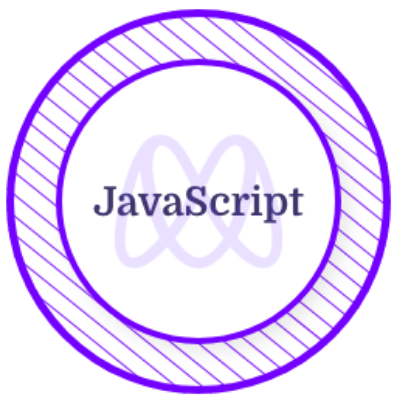
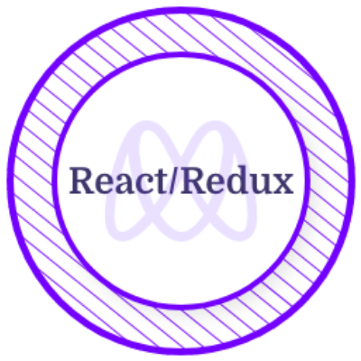
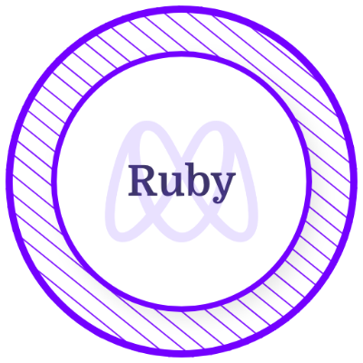
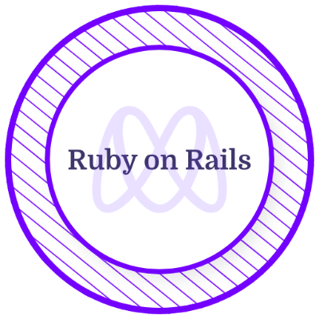
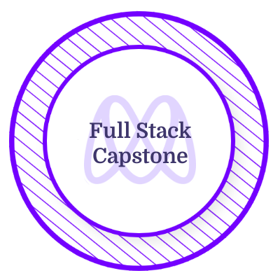

<h1 align="center"> Hi there👋, I'm Ogaga</h1>
<h3 align="center">I am a software developer from Nigeria</h3>

I have a passion for coding, designing, problem-solving, and learning new things. I also love developing websites because it makes me bring my ideas to life.

---

- 👩‍💻 I’m currently studying and training to become a **Full-stack Software Developer** in a remote, collaborative and multicultural environment at [Microverse.](https://github.com/microverseinc)

- 🌱 I’m currently deepening my knowledge in Ruby and Ruby on Rails.

- 💻 All **my projects** are available [here.](https://github.com/Ogaga01?tab=repositories)
- ### 🚀 Check out [my portfolio.](https://ogaga.me/)

### 📫 Reach me on:

 

- ✨ Interests: coding, reading books, designing, gisting.

---

<h2 align="center">Skills</h2>

  

	
	
	
	
	
	
	
	
	
	
	
	
	
	
	
	
	
	
 	

<h2 align="left">Certificates & Licenses</h2>

  &nbsp; &nbsp; &nbsp; &nbsp;  &nbsp;  &nbsp;  &nbsp;  &nbsp;  &nbsp; 

<h2 align ="left">GitHub Stats</h2>

  
  

<!--
**Ogaga01/Ogaga01** is a ✨ _special_ ✨ repository because its `README.md` (this file) appears on your GitHub profile.

Here are some ideas to get you started:

- 🔭 I’m currently working on ...
- 🌱 I’m currently learning ...
- 👯 I’m looking to collaborate on ...
- 🤔 I’m looking for help with ...
- 💬 Ask me about ...
- 📫 How to reach me: ...
- 😄 Pronouns: ...
- ⚡ Fun fact: ...
-->
